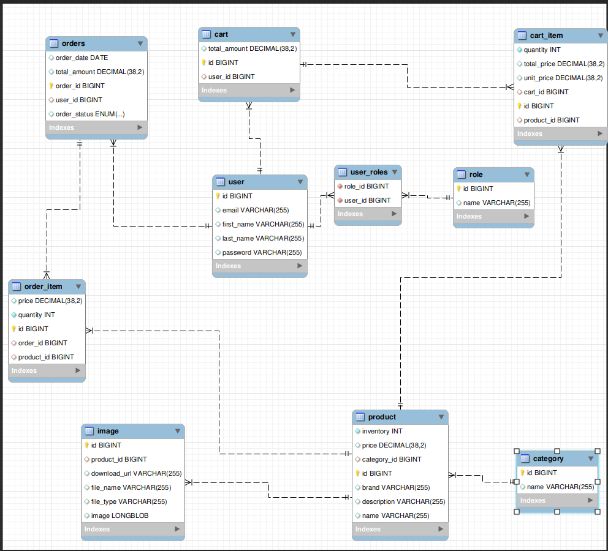

# Spring Boot, Spring Security, JWT Course – Shopping Cart Backend Java Project
This is the backend project for the Spring Boot, Spring Security, JWT Course – Shopping Cart. This project is built using Java, Spring Boot, Spring Security, JWT, and MySQL.
## Review project
This project is a simple shopping cart application that allows users to register, login, and manage their shopping cart. 
### EER Diagram

### Features
* User registration and login
* JWT authentication
* User roles (admin, user)
* Product management (CRUD operations)
* Shopping cart management (CRUD operations)
* Order management (CRUD operations)
## Getting Started
To get started you can simply clone the repository:

```
git clone github.com:yourusername/shopping-cart-backend.git
```

## Prerequisites
Before you begin, ensure you have met the following requirements:
* You have installed the latest version of Java 17+
* You have a Windows/Linux/Mac machine.
* You have installed an IDE like Eclipse or IntelliJ IDEA.
* You have installed the latest version of MySQL.
* You have installed the latest version of Postman.
* You have installed the latest version of Maven.
* You have installed the latest version of Node.js.
* You have installed the latest version of npm.
* [Youtube](https://www.youtube.com/watch?v=oGhc5Z-WJSw)